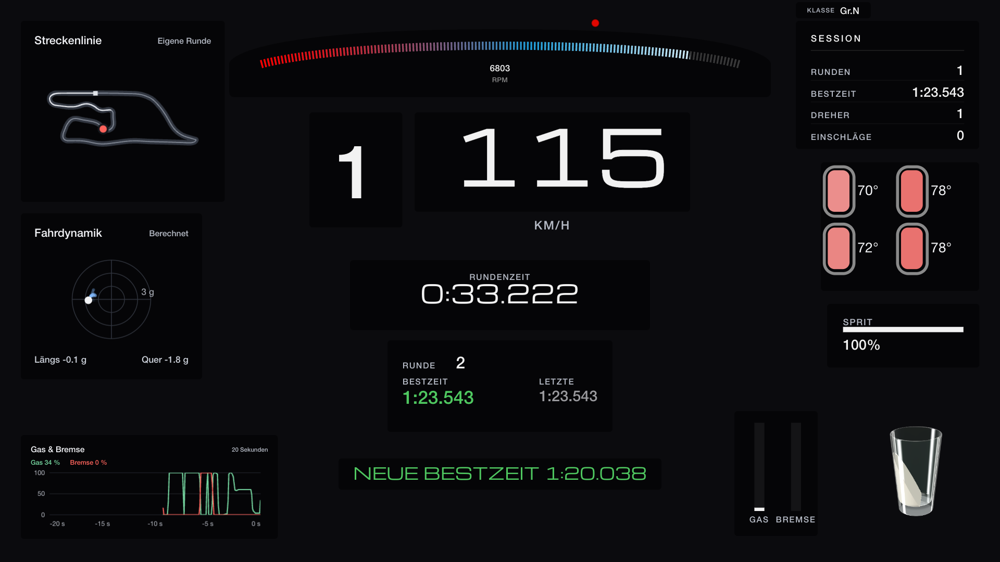
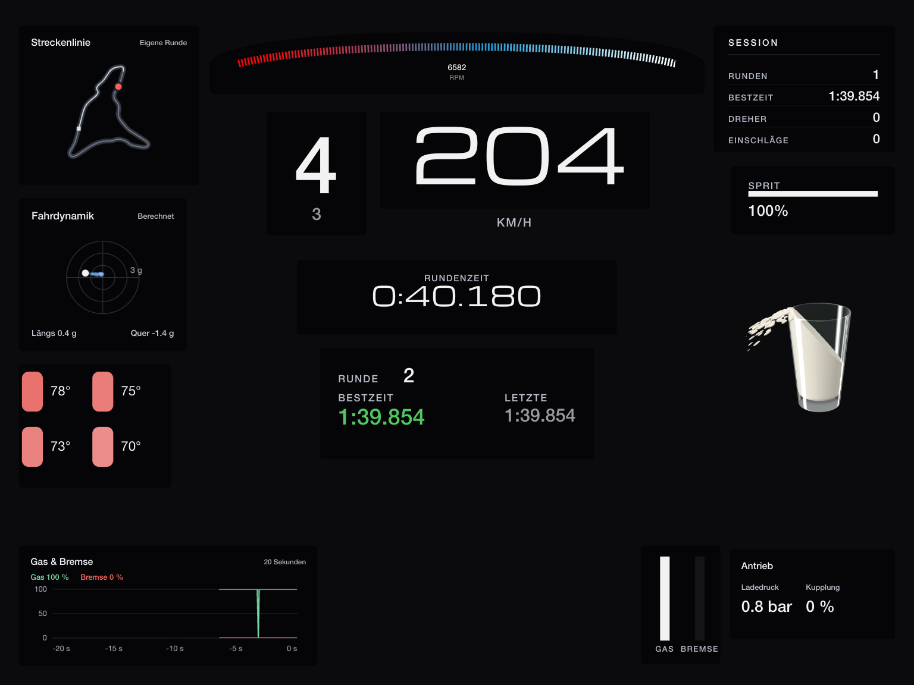
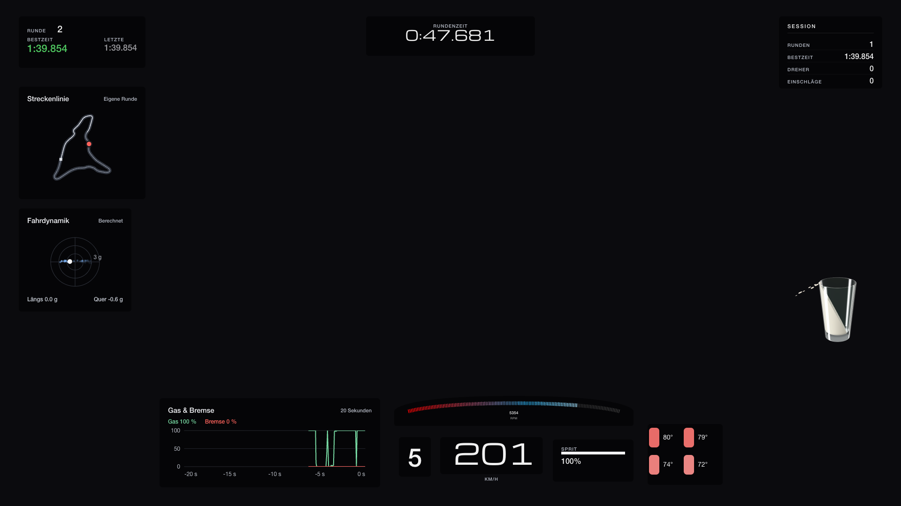
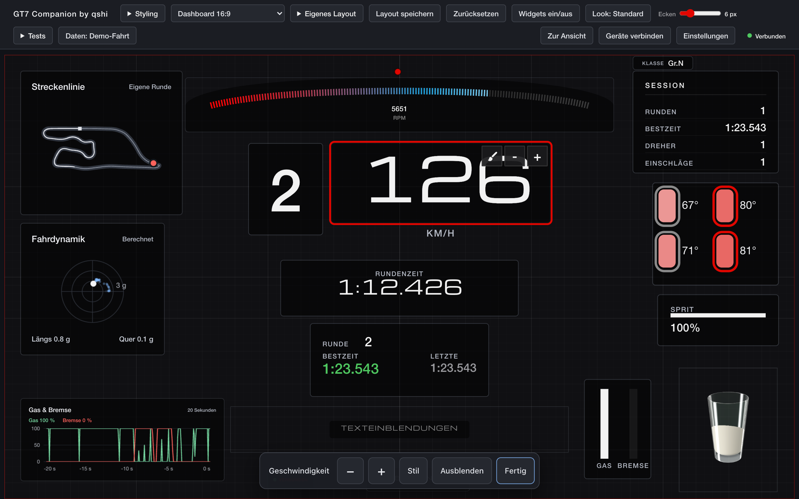
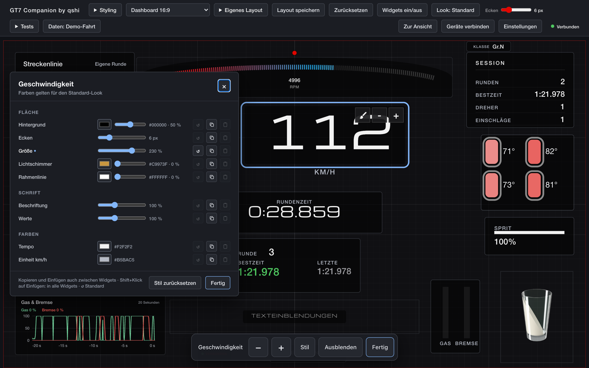
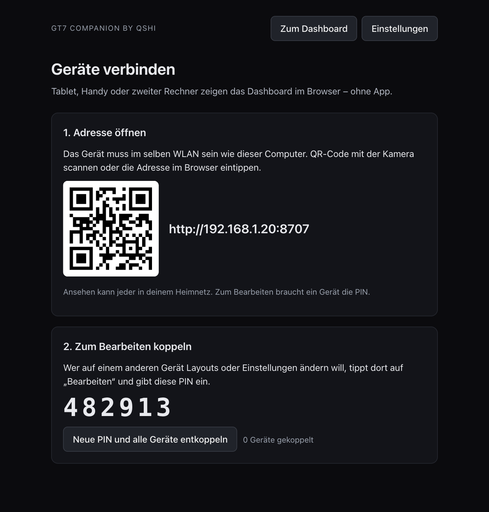
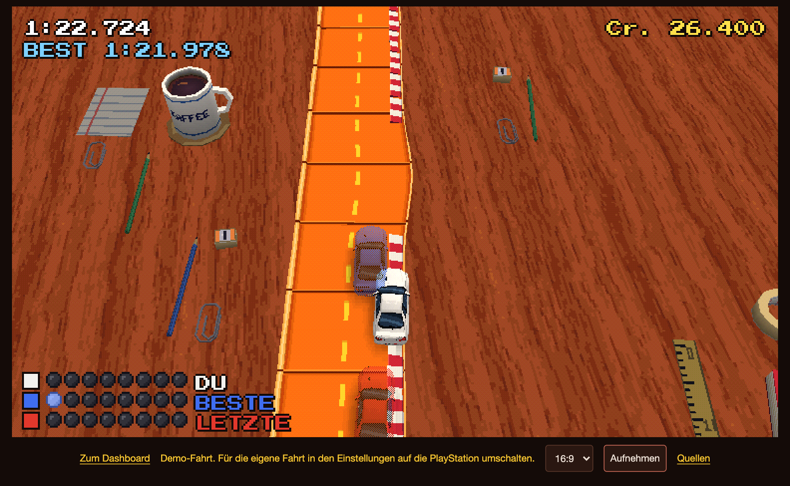
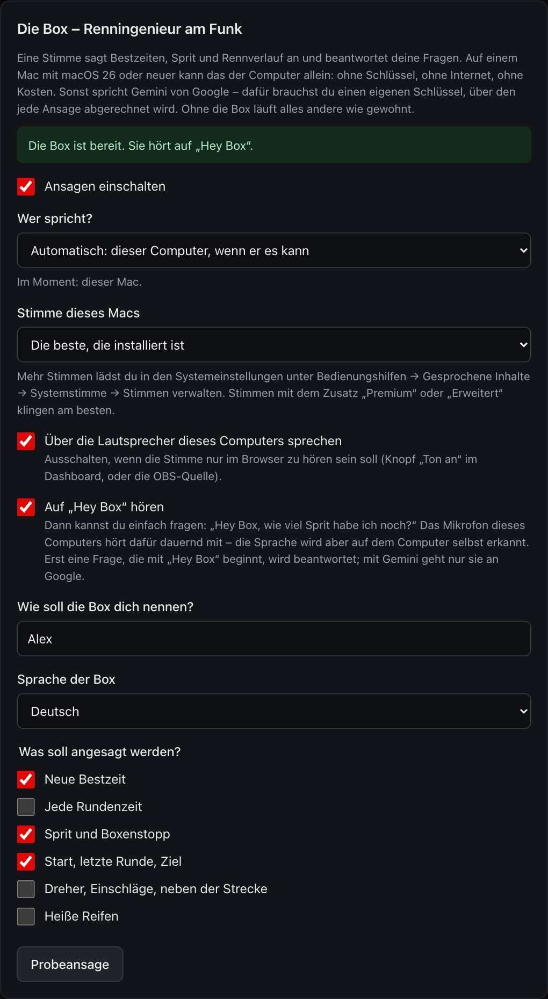
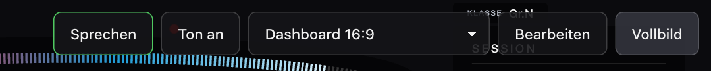

# Gran Turismo 7 Companion by qshi

Ein inoffizielles Dashboard und Stream-Overlay für Gran Turismo 7: Tempo, Gang, Drehzahl,
Rundenzeiten, Pedale, Reifen, Sprit, Fahrdynamik, Streckenlinie – und ein Glas Milch (oder ein
Wackeldackel), das sich mit den Kräften im Auto bewegt.

Ein kleines Programm läuft auf deinem PC oder Mac. Es empfängt die Fahrdaten des Spiels von
deiner PlayStation im Heimnetz und liefert das Dashboard als Webseite aus: für denselben
Rechner, für ein Tablet neben dem Rig oder als Browser-Quelle in OBS.



*English version: [README.md](README.md)*

> **Inoffiziell.** Dieses Projekt steht in keiner Verbindung zu Sony Interactive Entertainment
> oder Polyphony Digital und wird von ihnen weder unterstützt noch gebilligt. „Gran Turismo“
> und „PlayStation“ sind Marken ihrer Inhaber. Das Programm liest die Fahrdaten, die das Spiel
> auf Anfrage im lokalen Netz sendet; das Format ist vom Hersteller nicht dokumentiert und kann
> sich mit jedem Update des Spiels ändern oder wegfallen. Nutzung auf eigene Gefahr.

## Was du bekommst

- **Dashboards** für Bildschirme in 16:9, 16:10 und 4:3 und ein durchsichtiges **Overlay** für
  Streams. Jeder Bildschirm bekommt das Layout, das zu seiner Form passt; es wird als Ganzes
  eingepasst, nie abgeschnitten.
- **Einen Editor** im Browser: jede Anzeige verschieben, in der Größe ändern, ausblenden und
  gestalten – mit der Maus oder mit dem Finger. Eigene Layouts anlegen, Schriften wählen,
  Stile kopieren und Änderungen rückgängig machen. **Layout speichern** sichert zusätzlich
  zum Autosave einen Stand, zu dem **Zurücksetzen** zurückkehrt.
- **Meldungen und Zähler**: neue Bestzeit, Dreher, Einschläge, Runden der Sitzung.
- **Andere Geräte** kommen per QR-Code dazu. Ansehen darf jeder in deinem Heimnetz;
  Bearbeiten auf einem anderen Gerät braucht eine PIN.
- **Deutsch und Englisch**, km/h oder mph, °C oder °F.
- **Die Box** (wer mag): ein Renningenieur am Funk, der Bestzeiten und Sprit ansagt und Fragen
  beantwortet – auf einem Mac ganz ohne Dienst und Schlüssel, sonst mit deinem eigenen Schlüssel
  für Google Gemini.
  Für Bestzeiten, Dreher und Einschläge gibt es jeweils 50 positive Funk-Varianten in beiden Sprachen.
- **Eine Demo-Fahrt** ist eingebaut: eine aufgezeichnete Fahrt über vier Runden. Du kannst alles
  ohne Konsole ausprobieren, auch die Rundenzeiten und den Untergrund-Ring.
- **Tisch Turismo**, ein kleines Spiel nebenbei: Ein Spielzeugauto fährt auf einem Schreibtisch
  nach, was du fährst, und deine eigenen früheren Runden fahren dagegen. Gedacht für die
  Zuschauer eines Streams.

<p>
  
  
  
</p>

*Aufgenommen bei einer echten Fahrt: das Glas Milch, der Wackeldackel und die Reifen mit dem
Untergrund-Ring, der auf dem Randstein blinkt. Auch die Demo-Fahrt enthält die Untergrund-Daten,
den Ring siehst du also ohne Konsole.*

| Dashboard auf einem 4:3-Tablet | Layout für den Stream (in OBS durchsichtig) |
|---|---|
|  |  |

| Editor: Anzeige wählen, Knöpfe unten | Stil einer einzelnen Anzeige |
|---|---|
|  |  |

## Start

**Mac mit Apple-Chip (macOS 14 oder neuer): die App.** [GT7-Companion-by-qshi-mac-arm64.dmg](https://github.com/qshiqshi/gt7-companion-by-qshi/releases/latest/download/GT7-Companion-by-qshi-mac-arm64.dmg)
laden, öffnen, die App in „Programme“ ziehen und starten. Sie zeigt das Dashboard in einem
eigenen Fenster, mit einem Symbol im Dock und in der Menüleiste. Das Fenster zu schließen
beendet sie nicht – Tablets und OBS bekommen weiter ihre Daten; beendet wird mit ⌘Q oder über
das Symbol.

**Windows 10 oder 11: das Programm als ZIP.** [GT7-Companion-by-qshi-windows-x64.zip](https://github.com/qshiqshi/gt7-companion-by-qshi/releases/latest/download/GT7-Companion-by-qshi-windows-x64.zip)
laden, entpacken und im Ordner `gt7companion.exe` starten. Es zeigt das Dashboard in einem
eigenen Fenster, mit einem Symbol neben der Uhr. Es ist nicht signiert: Windows fragt beim
ersten Start nach (**Weitere Informationen** → **Trotzdem ausführen**).

**Alle anderen: aus dem Quelltext.** Die Anleitung Schritt für Schritt steht in
[docs/INSTALL.de.md](docs/INSTALL.de.md) (Doppelklick auf `start-windows.bat` bzw.
`start-mac.command`).

> **Frühe Fassung.** Geprüft mit automatischen Tests, mit einem Nachbau der Konsole und des
> Sprachdienstes und – die App und die Box auf dem Mac – auf einem Mac mit macOS 27 und einer
> echten PlayStation. Das Windows-Programm wurde in einer virtuellen Maschine (Windows 11 auf
> ARM) gebaut und gestartet; auf einem echten Windows-PC, mit Ton, Mikrofon und echter
> PlayStation ist es ungetestet.

Von Hand – benötigt Python 3.12 oder neuer:

```sh
python -m venv .venv
.venv/bin/pip install -e ".[app]"          # Windows: .venv\Scripts\pip install -e ".[app]"
.venv/bin/python -m gt7companion.launcher  # Symbol in der Menüleiste / im Tray, öffnet das Dashboard
```

Mit `".[app,window]"` zeigt auch dieser Start das Dashboard in einem eigenen Fenster.

Ohne Symbol: `python -m gt7companion` und <http://127.0.0.1:8707/> öffnen.

| Option von `python -m gt7companion` | Bedeutung |
|---|---|
| `--demo` | die aufgezeichnete Demo-Fahrt (vier Runden) in Schleife (Standard, bis du etwas anderes wählst) |
| `--live` | der PlayStation im Heimnetz zuhören |
| `--lan` / `--no-lan` | anderen Geräten im Heimnetz das Dashboard freigeben (Standard: wie in den Einstellungen) |
| `--port 8707` | Port der Webseiten |
| `--ps5 IP` | Adresse der Konsole; ohne Angabe wird sie gesucht |

Die App selbst baut `python packaging/build.py` (braucht [uv](https://docs.astral.sh/uv/) und
am Mac Xcode 27 oder neuer für das Hilfsprogramm der Box – `--no-box-helper` baut ohne es;
Hinweise in der Datei, auch zum Signieren).

## Deine PlayStation

1. Konsole und Rechner sind im selben Heimnetz.
2. Gran Turismo 7 starten.
3. Unter *Einstellungen* „PlayStation im Heimnetz“ wählen (oder mit `--live` starten).

Die Konsole wird von selbst gefunden, ihre Adresse gemerkt. Kommt nichts an:

- Die Firewall muss dem Programm den Empfang erlauben (UDP-Port 33740). Windows fragt beim
  ersten Start.
- Auf einem Rechner kann nur ein Programm die Fahrdaten empfangen. Andere Telemetrie-Programme
  beenden.
- Gäste-WLAN und „Client-Isolation“ trennen Geräte voneinander – das normale Heimnetz nehmen.

## Tablet, Handy, zweiter Bildschirm

„Im Heimnetz freigeben“ einschalten (Menü des Symbols, *Einstellungen* oder `--lan`), dann am
Rechner *Geräte verbinden* öffnen: Dort steht die Adresse als QR-Code. Ansehen darf jeder in
deinem Heimnetz. Wer auf einem anderen Gerät Layouts oder Einstellungen ändern will, tippt dort
auf *Bearbeiten* und gibt die PIN von derselben Seite ein.

Am Rechner selbst bleibt der Bildschirm an, solange die Konsole Daten schickt. Tablets schalten
ihn ab (dort verbieten es die Browser): Bildschirmsperre ausschalten oder den Kiosk-Modus des
Geräts nutzen (auf dem iPad „Geführter Zugriff“). Zum Home-Bildschirm hinzugefügt, erscheint
die Seite ohne die Leisten des Browsers.



## OBS

Eine Quelle *Browser* anlegen, 1920 × 1080, mit der Adresse `http://127.0.0.1:8707/?obs=1`.
Sie ist durchsichtig, zeigt das Overlay-Layout und blendet die Fahranzeigen aus, solange du in
den Menüs bist. `?layout=<Name>` wählt ein anderes Layout, `?lang=en` und `?units=imperial`
stellen Sprache und Einheiten für diese Quelle ein.

## Tisch Turismo – das Spiel auf dem Schreibtisch



Ein Spielzeugauto fährt auf einem Schreibtisch genau das nach, was dein Auto auf der PlayStation
gerade tut – im Aussehen eines Rennspiels der Neunzigerjahre. Einen Controller braucht es nicht:
Du spielst, indem du Gran Turismo 7 fährst.

1. **Vermessen:** Bis zur ersten vollen Runde zieht das Auto eine Kreidelinie über den Tisch.
2. **Bahn:** Ist die Runde zu, klicken entlang der Linie orange Bahnteile ein. In den nächsten
   Runden rückt die Bahn noch dorthin, wo du wirklich fährst.
3. **Gegner:** Deine Bestrunde (blau) und deine letzte Runde (rot) fahren als Spielzeugautos mit.
4. **Wertung:** Wer den anderen abhängt, bekommt ein Licht; acht Lichter gewinnen die Partie.
   Münzen auf der Bahn bringen Cr., Öl kostet welche, Drifts zählen nach Winkel und Dauer.

Du öffnest es über das Menü des Symbols (*Tisch Turismo (Spiel)*), über das Menü des Dashboards
oder unter `http://127.0.0.1:8707/game`. Ohne Konsole fährt die Demo-Fahrt. Unter dem Bild wählst
du seine Form (4:3, 16:9 oder 9:16); *Aufnehmen* speichert das Bild als Video (im Browser, nicht
im Fenster der App).

**In OBS** eine zweite Quelle *Browser* anlegen: `http://127.0.0.1:8707/game?obs=1&format=wide`,
1536 × 864. Für 4:3 `format` weglassen und 1280 × 960 nehmen, für 9:16 `format=portrait` und
864 × 1536 – bei diesen Größen ist jedes Pixel des Spiels genau zwei Pixel breit. `&delay=640`
hält das Bild um so viele Millisekunden zurück, damit es zu einem Spielbild passt, das verspätet
in OBS ankommt (Capture-Karte). Wird die Quelle mitten im Rennen neu geladen, baut das Spiel
Bahn, Gegner und Punktestand aus der bisherigen Fahrt wieder auf.

**Zuschauer spielen mit**, wenn du deinen Twitch-Kanal nennst: `&channel=deinkanal`. `!münze`
legt eine Münze voraus auf die Bahn, `!öl` einen Ölfleck (je Zuschauer alle 20 Sekunden). Dafür
liest die Seite den öffentlichen Chat dieses Kanals direkt bei Twitch mit.

Die Zettel auf dem Schreibtisch erzählen kleine wahre Geschichten über Gran Turismo. *Quellen*
unter dem Bild nennt die Belege – und wessen Arbeit im Spiel steckt.

## Sprache und Einheiten

Deutsch und Englisch; jedes Gerät nimmt seine eigene Sprache, solange du unter *Einstellungen*
keine festlegst. Tempo in km/h oder mph, Temperaturen in °C oder °F.

## Die Box (wer mag)



Ein Renningenieur am Funk: Eine Stimme sagt Bestzeiten, Sprit und Rennverlauf an und beantwortet
Fragen. Unter *Einstellungen* → „Wer spricht?“ gibt es zwei Wege:

- **Dieser Mac** (in der App, ab macOS 26): Stimme, Spracherkennung und Sprachmodell kommen vom
  Mac selbst. Kein Schlüssel, keine Kosten, und nichts verlässt den Rechner; Internet braucht
  er nur, bis macOS die Sprachdaten einmal geladen hat. Das ist die Voreinstellung, wo es
  geht.
- **Gemini von Google** (überall): gesprochen von Googles Gemini Live API mit **deinem eigenen
  API-Schlüssel** aus Google AI Studio, den du am Rechner mit dem Programm einträgst. Jede
  Ansage wird über deinen Schlüssel abgerechnet; deshalb gibt es hier eine Grenze pro Minute
  und pro Sitzung und einen Zähler für den Verbrauch.

Für beide gilt:

- Voreingestellt ist „nur das Wichtigste“ (Bestzeit, Sprit, Start und Ziel).
- Der Ton kommt aus den Lautsprechern des Rechners (aus dem Quelltext mit dem Zusatz
  `pip install -e ".[box]"`) oder aus jedem Browser mit dem Dashboard, nachdem dort „Ton an“
  getippt wurde; eine OBS-Quelle spielt ihn ohne Tippen ab.
- Zurücksprechen: den Knopf „Sprechen“ im Menü des Dashboards gedrückt halten und fragen
  („Wie viel Sprit ist noch drin?“). Benutzt wird das Mikrofon des Rechners, auch wenn der
  Knopf auf einem Tablet gehalten wird. Für einen eigenen Knopf: `POST /api/box/talk` mit
  `{"on": true}` und `{"on": false}`.
- „Hey Box“: unter *Einstellungen* einschalten und einfach fragen: „Hey Box, wie viel Sprit
  habe ich noch?“ Das Mikrofon des Rechners hört dann dauernd mit, die Sprache wird aber auf dem
  Rechner selbst erkannt; nur eine Frage, die mit „Hey Box“ beginnt, wird beantwortet. In der
  Mac-App erkennt der Mac selbst; aus dem Quelltext braucht es den Zusatz
  `pip install -e ".[wake]"` (Whisper, lädt sein Modell von rund 500 MB einmalig herunter).
- Wenn du streamst: Kennzeichne die Stimme als KI-erzeugt, wo deine Plattform oder das Gesetz
  es verlangt.

Spricht der Mac allein:

- Auf Fragen antwortet die Box mit festen Sätzen und den echten Werten der Fahrt: Sprit,
  Runden, Zeiten, Reifen, Tempo, Dreher. Das Sprachmodell des Macs entscheidet nur, worum es
  geht – eine Zahl erfinden kann es so nicht. Auf alles andere sagt sie, dass sie dazu nichts
  hat.
- Für Fragen muss Apple Intelligence eingeschaltet sein; die Ansagen funktionieren auch ohne.
- Die Stimme wählst du in den Einstellungen. Bessere Stimmen („Premium“, „Erweitert“) lädst du
  in den Systemeinstellungen unter Bedienungshilfen → Gesprochene Inhalte → Systemstimme →
  Stimmen verwalten.

Spricht Gemini:

- Die Box schlägt Sprit, Reifen, Runden und Zeiten nach, bevor sie antwortet, und formuliert
  frei.
- Was an Google geht: der Text jeder Ansage (zum Beispiel „Neue Bestzeit: 1:39,9“), der Name,
  den du gewählt hast, deine gesprochenen Fragen und – wenn du fragst – die aktuellen Werte
  der Fahrt. Für dich als Inhaber des Schlüssels gelten Googles Bedingungen für die Gemini API;
  prüfe, ob sie deine Nutzung an deinem Wohnort erlauben.
- Der Schlüssel liegt nur auf deinem Rechner (`secrets.json`, nur für dich lesbar) und wird nie
  wieder angezeigt, an eine Seite geschickt oder in ein Protokoll geschrieben.

Ohne die Box läuft alles andere wie gewohnt.

<br clear="both">

Das Menü des Dashboards erscheint, wenn du den Zeiger bewegst oder den Bildschirm berührst:



## Datenschutz und Sicherheit

- Das Programm spricht mit deiner PlayStation und mit den Geräten in deinem Heimnetz. Ins
  Internet geht nichts – außer an Google, wenn du die Box mit Gemini nutzt (siehe oben). Das
  Spiel liest den Chat eines Twitch-Kanals nur mit, wenn du in seiner Adresse einen nennst.
- Es ist für ein Heimnetz gemacht. Gib seinen Port nicht ins Internet frei.
- Einstellungen und eigene Layouts liegen in deinem Benutzerordner (`gt7-companion-by-qshi`).

## Entwicklung

```sh
.venv/bin/pip install -e ".[dev,app,window]"
.venv/bin/python -m unittest discover -s tests -q
node --test tests/js/
```

Am Mac baut `python tools/build_box_helper.py` das Hilfsprogramm, mit dem die Box ohne Dienst
läuft (Swift, `native/box-helper`); danach laufen auch die Tests dazu. Zum Bauen braucht es
Xcode 27 oder neuer; das Hilfsprogramm selbst läuft ab macOS 26.

Siehe [CONTRIBUTING.md](CONTRIBUTING.md) (englisch).

## Lizenz

Copyright © 2026 qshi. Freie Software unter der
[GNU General Public License, Version 3 oder neuer](LICENSE): Du darfst sie nutzen, untersuchen,
weitergeben und ändern; geänderte Fassungen, die du weitergibst, müssen unter derselben Lizenz
frei bleiben. Es gibt keine Gewährleistung.

Enthaltene Teile anderer behalten ihre eigenen Lizenzen, siehe
[THIRD_PARTY_NOTICES.md](THIRD_PARTY_NOTICES.md). Woher der Code stammt, steht in
[PROVENANCE.md](PROVENANCE.md).
