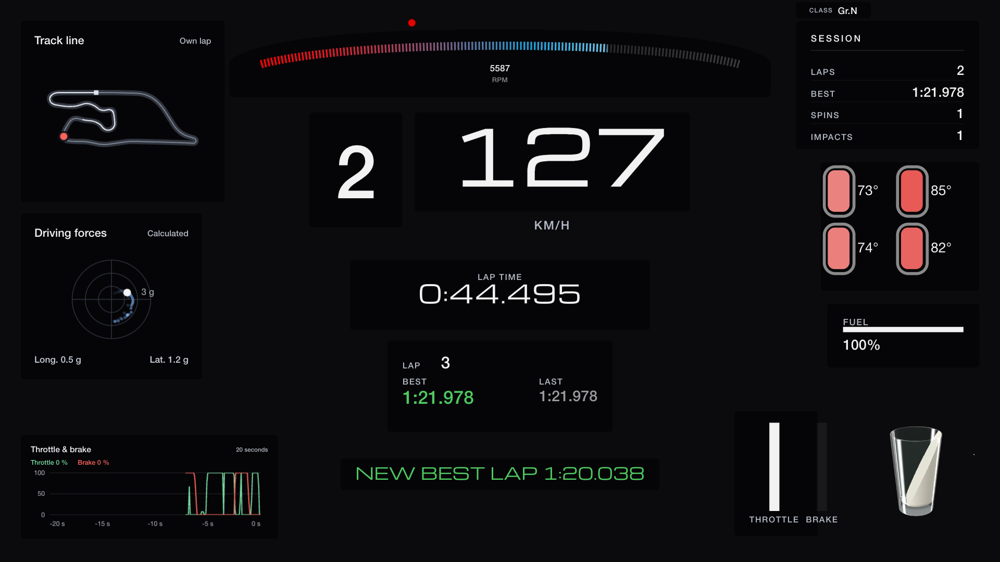
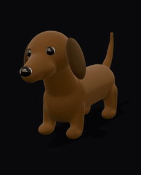
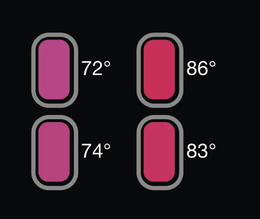
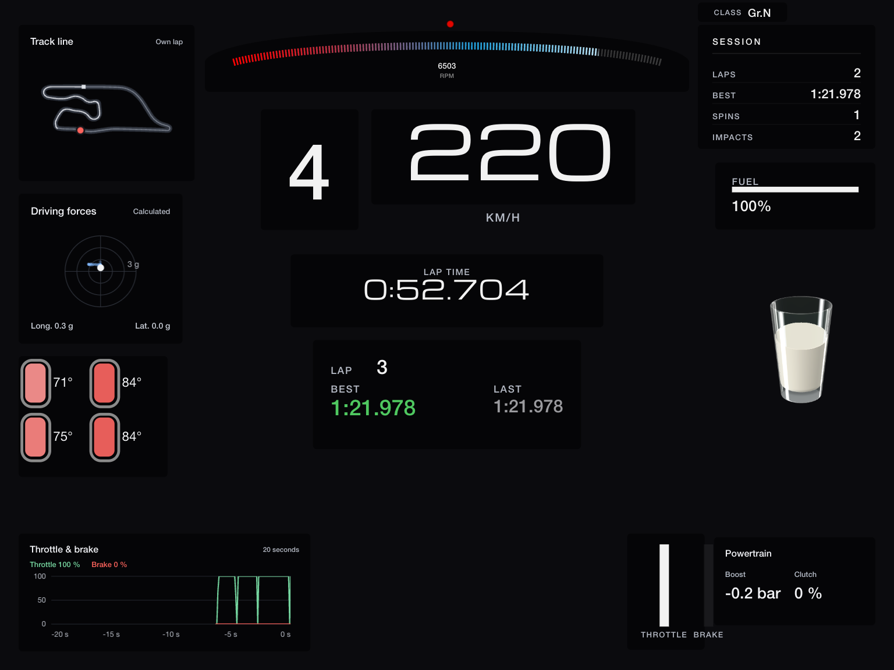
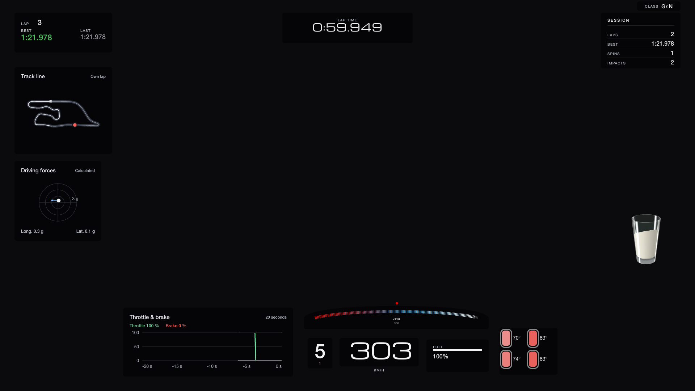
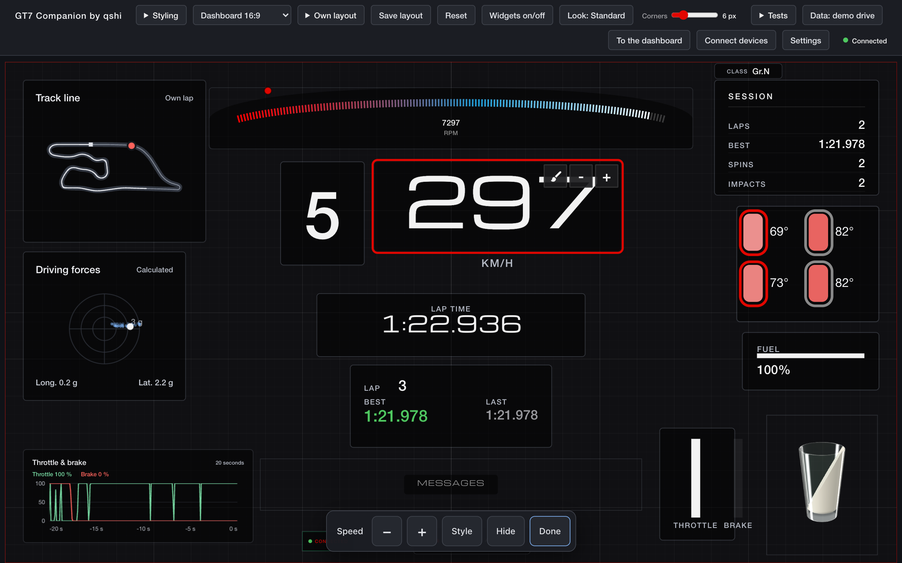
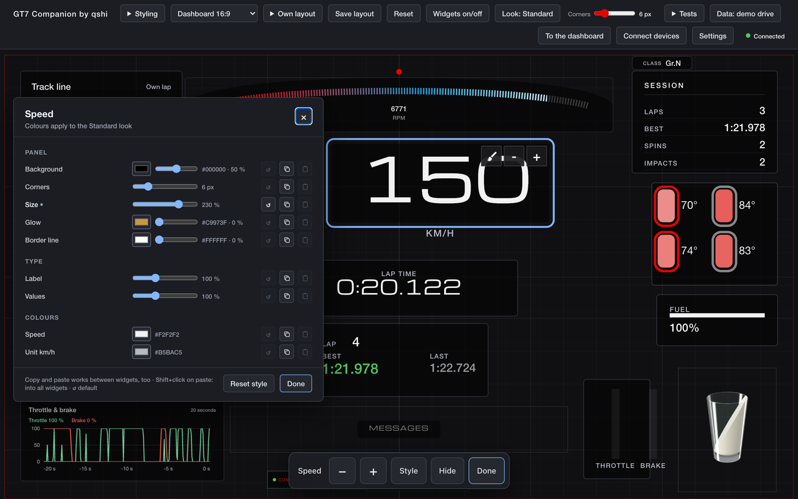
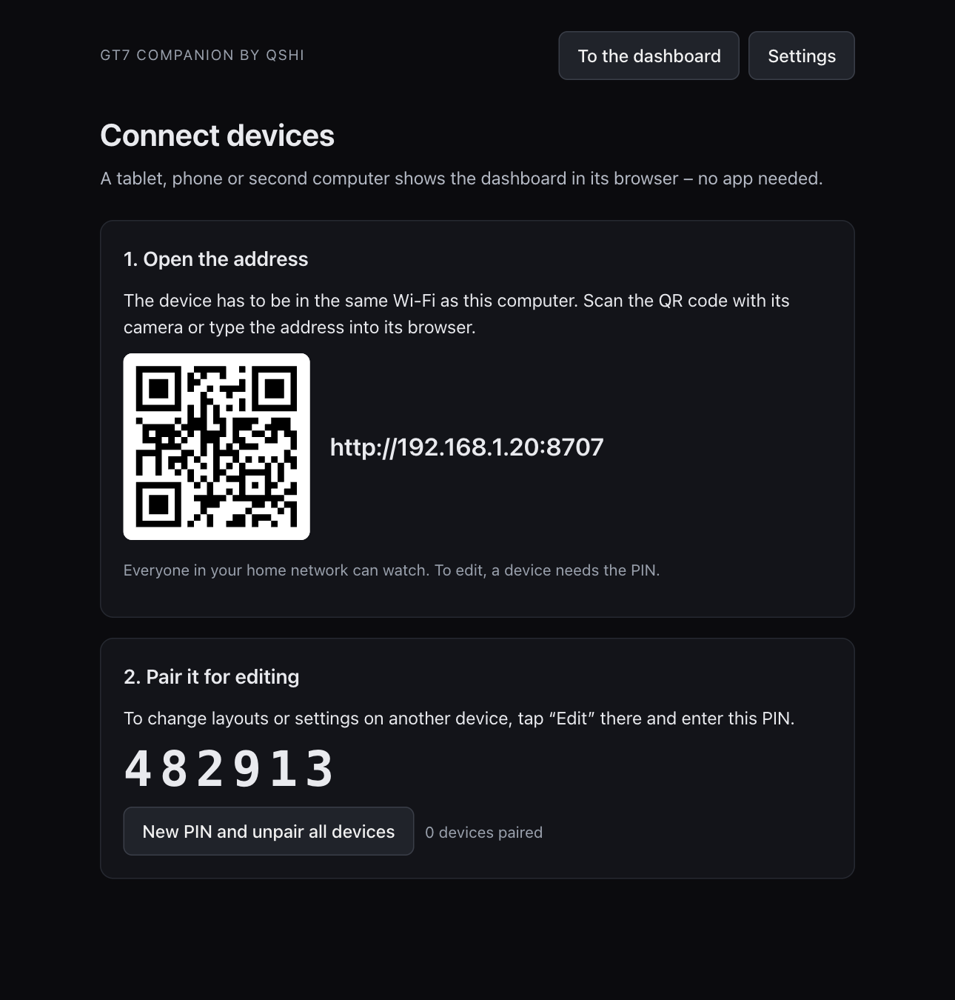
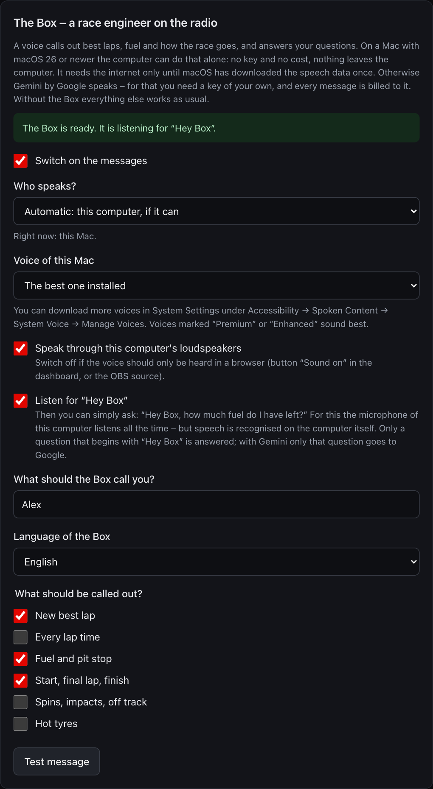
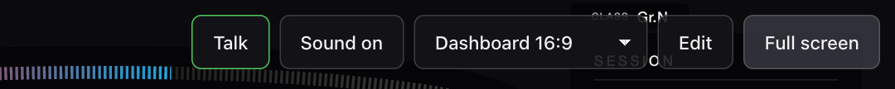

# Gran Turismo 7 Companion by qshi

An unofficial dashboard and stream overlay for Gran Turismo 7: speed, gear, revs, lap times,
pedals, tyres, fuel, G-forces, a track map – and a glass of milk (or a nodding dachshund)
that moves with the forces in the car.

One small program runs on your PC or Mac. It receives the game's telemetry from your
PlayStation in the home network and serves the dashboard as a web page: for the same
computer, for a tablet next to your rig, or as a browser source in OBS.



*Deutsche Fassung: [README.de.md](README.de.md)*

> **Unofficial.** This project is not affiliated with, endorsed by or connected to Sony
> Interactive Entertainment or Polyphony Digital. "Gran Turismo" and "PlayStation" are
> trademarks of their respective owners. The program reads the telemetry that the game sends
> on request in the local network; the format is not documented by the publisher and may
> change or disappear with any update of the game. Use at your own risk.

## What you get

- **Dashboards** for 16:9, 16:10 and 4:3 screens and a transparent **overlay** for streams.
  Every screen gets the layout that fits its shape; the whole layout is scaled, never cropped.
- **An editor** in the browser: move, resize, scale, hide and style every widget – with a
  mouse or with your fingers. Make your own layouts.
- **Messages and counters**: new best lap, spins, impacts, laps of the session.
- **Other devices** join with a QR code. Watching is open to your home network; editing on
  another device needs a PIN.
- **German and English**, km/h or mph, °C or °F.
- **The Box** (optional): a race engineer on the radio who calls out best laps and fuel and
  answers questions – on a Mac without any service or key, elsewhere with your own Google
  Gemini API key.
- **A demo drive** is built in: a recorded drive of four laps. You can try everything without
  a console, lap times and the surface ring included.

<p>
  
  
  
</p>

*Recorded from a real drive: the glass of milk, the nodding dachshund, and the tyres with the
surface ring that flashes on a kerb. The demo drive carries the surface data as well, so you can
see the ring without a console.*

| Dashboard on a 4:3 tablet | Layout for the stream (transparent in OBS) |
|---|---|
|  |  |

| Editor: choose a widget, buttons below | Style of a single widget |
|---|---|
|  |  |

## Start

**Mac with Apple silicon (macOS 14 or newer): the app.** Download
[GT7-Companion-by-qshi-mac-arm64.dmg](https://github.com/qshiqshi/gt7-companion-by-qshi/releases/latest/download/GT7-Companion-by-qshi-mac-arm64.dmg),
open it, drag the app to "Applications" and start it. It shows the dashboard in a window of
its own, with an icon in the Dock and a symbol in the menu bar. Closing the window does not
quit it – tablets and OBS keep getting their data; quit with ⌘Q or through the symbol.

**Windows 10 or 11: the program as a ZIP.** Download
[GT7-Companion-by-qshi-windows-x64.zip](https://github.com/qshiqshi/gt7-companion-by-qshi/releases/latest/download/GT7-Companion-by-qshi-windows-x64.zip),
unpack it and start `gt7companion.exe` in the folder. It shows the dashboard in a window of its
own, with a symbol next to the clock. It is not signed: Windows asks on the first start
(**More info** → **Run anyway**).

**Everybody else: from source.** The step-by-step guide is
[docs/INSTALL.md](docs/INSTALL.md) (double-click `start-windows.bat` or `start-mac.command`).

> **Early version.** Checked with automated tests, with a stand-in for the console and for the
> voice service and – the app and the Box on the Mac – on one Mac with macOS 27 and a real
> PlayStation. The Windows program was built and started in a virtual machine (Windows 11 on
> ARM); on a real Windows PC, with sound, microphone and a real PlayStation, it is untested.

By hand – requires Python 3.12 or newer:

```sh
python -m venv .venv
.venv/bin/pip install -e ".[app]"          # Windows: .venv\Scripts\pip install -e ".[app]"
.venv/bin/python -m gt7companion.launcher  # symbol in the menu bar / tray, opens the dashboard
```

With `".[app,window]"` this start shows the dashboard in a window of its own, too.

Without the symbol: `python -m gt7companion` and open <http://127.0.0.1:8707/>.

| Option of `python -m gt7companion` | Meaning |
|---|---|
| `--demo` | play the recorded demo drive (four laps) in a loop (default until you choose otherwise) |
| `--live` | listen to the PlayStation in the home network |
| `--lan` / `--no-lan` | let other devices in the home network open the dashboard (default: as chosen in the settings) |
| `--port 8707` | port of the web pages |
| `--ps5 IP` | address of the console; without it the console is searched |

The app itself is built with `python packaging/build.py` (needs
[uv](https://docs.astral.sh/uv/), and on a Mac Xcode 27 or newer for the helper of the Box –
`--no-box-helper` builds without it; see the notes in that file, also on signing).

## Your PlayStation

1. Console and computer are in the same home network.
2. Start Gran Turismo 7.
3. Choose *PlayStation in the home network* under *Settings* (or start with `--live`).

The console is found by itself; its address is remembered. If nothing arrives:

- Your firewall has to let the program receive (UDP port 33740). Windows asks on first start.
- Only one program on a computer can receive the telemetry. Quit other telemetry tools.
- Guest Wi-Fi and "client isolation" keep devices apart – use the normal home network.

## Tablet, phone, second screen

Switch on *Share in the home network* (menu of the symbol, *Settings*, or `--lan`), then open
*Connect devices* on the computer: it shows the address as a QR code. Everyone in the home
network may watch. To edit layouts or settings on another device, tap *Edit* there and
enter the PIN from the same page.

On the computer itself the screen stays on while the console sends data. Tablets go to sleep
(browsers do not allow it there): set the display to stay on, or use the device's kiosk mode ("Guided
Access" on an iPad). Adding the page to the home screen shows it without the browser's bars.



## OBS

Add a *Browser* source, 1920 × 1080, with the address `http://127.0.0.1:8707/?obs=1`.
It is transparent, shows the overlay layout and hides the driving widgets while you are in
the menus. `?layout=<name>` picks another layout, `?lang=en` and `?units=imperial` set
language and units for this source.

## Language and units

German and English; each device uses its own language unless you choose one under *Settings*.
Speed in km/h or mph, temperatures in °C or °F.

## The Box (optional)



A race engineer on the radio: a voice calls out best laps, fuel and the course of the race and
answers questions. Under *Settings* → "Who speaks?" there are two ways:

- **This Mac** (in the app, macOS 26 or newer): voice, speech recognition and language model
  are the Mac's own. No key, no cost, and nothing leaves the computer; it needs the internet
  only until macOS has downloaded its speech data once. This is the default where it is
  possible.
- **Gemini by Google** (everywhere): spoken by Google's Gemini Live API with **your own API
  key** from Google AI Studio, entered on the computer running the program. Every message is
  billed to your key; that is why there is a limit per minute and per session here, and a
  counter that shows the use.

For both:

- The default is "only what matters" (best lap, fuel, start and finish).
- Sound comes from the computer's loudspeakers (from source with the extra
  `pip install -e ".[box]"`) or from any browser showing the dashboard after a tap on
  "Sound on"; an OBS source plays it without a tap.
- Talk back: hold the "Talk" button in the dashboard menu and ask ("how much fuel is left?").
  The microphone of the computer is used, also when the button is held on a tablet. For a
  button of your own: `POST /api/box/talk` with `{"on": true}` and `{"on": false}`.
- "Hey Box": switch it on under *Settings* and simply ask, "Hey Box, how much fuel is left?".
  The computer's microphone then listens all the time, but speech is recognised on the
  computer itself; only a question that begins with "Hey Box" is answered. In the Mac app the
  Mac recognises it; from source it needs the extra `pip install -e ".[wake]"` (Whisper, which
  downloads its model of about 500 MB once).
- If you stream: say that the voice is generated by AI where your platform or the law asks
  for it.

When the Mac speaks alone:

- The Box answers questions with fixed sentences and the real values of the drive: fuel, laps,
  times, tyres, speed, spins. The language model of the Mac only decides what a question is
  about – that way it cannot make a number up. To everything else it says that it has nothing
  on that.
- Questions need Apple Intelligence to be switched on; the messages work without it.
- You choose the voice in the settings. Better voices ("Premium", "Enhanced") can be
  downloaded in System Settings under Accessibility → Spoken Content → System Voice → Manage
  Voices.

When Gemini speaks:

- The Box looks up fuel, tyres, laps and times before it answers, in its own words.
- What is sent to Google: the text of each message (for example "New best lap: 1:39.9"), the
  name you chose, your spoken questions, and – when you ask – the current values of the drive.
  Google's terms for the Gemini API apply to you as the holder of the key; check whether they
  allow your use where you live.
- The key is stored only on your computer (`secrets.json`, readable by you alone) and is never
  shown again, sent to a page or written to a log.

Without the Box everything else works as usual.

<br clear="both">

The menu of the dashboard appears when you move the pointer or touch the screen:



## Privacy and safety

- The program talks to your PlayStation and to the devices in your home network. Nothing is
  sent to the internet, except to Google when you use the Box with Gemini (see above).
- It is made for a home network. Do not open its port to the internet.
- Settings and your own layouts are stored in your user folder (`gt7-companion-by-qshi`).

## Development

```sh
.venv/bin/pip install -e ".[dev,app,window]"
.venv/bin/python -m unittest discover -s tests -q
node --test tests/js/
```

On a Mac, `python tools/build_box_helper.py` builds the helper program that lets the Box run
without a service (Swift, `native/box-helper`); with it the tests for that run, too. Building
it needs Xcode 27 or newer; the helper itself runs on macOS 26 and newer.

See [CONTRIBUTING.md](CONTRIBUTING.md).

## Licence

Copyright © 2026 qshi. Free software under the
[GNU General Public License, version 3 or later](LICENSE): you may use, study, share and change
it; changed versions that you pass on must stay free under the same licence. There is no
warranty.

Bundled parts by others keep their own licences, see
[THIRD_PARTY_NOTICES.md](THIRD_PARTY_NOTICES.md). Where the code comes from is listed in
[PROVENANCE.md](PROVENANCE.md).
