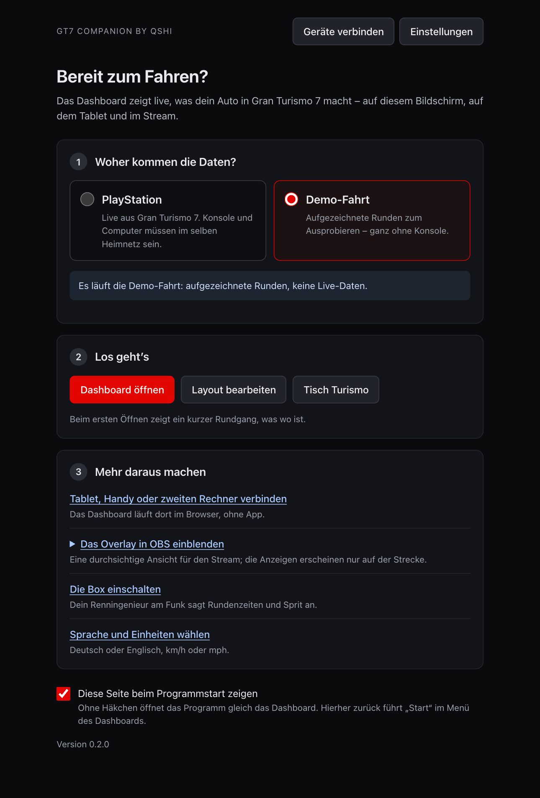
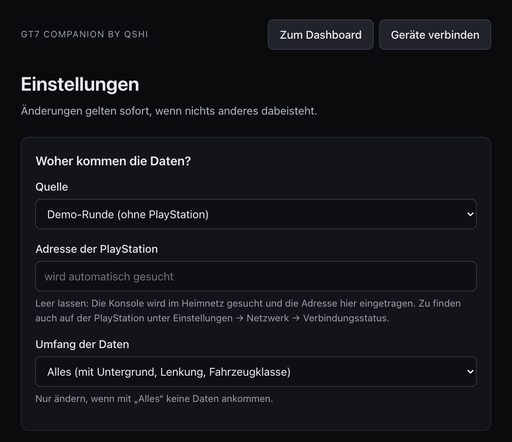

# Installieren – Schritt für Schritt

*English: [INSTALL.md](INSTALL.md)*

Du brauchst einen Mac oder Windows-PC im selben Heimnetz wie deine PlayStation.

## Mac: die App (der kurze Weg)

Für Macs mit Apple-Chip und macOS 14 oder neuer gibt es das Programm als fertige App – ohne
Python, ohne Terminal:

1. [GT7-Companion-by-qshi-mac-arm64.dmg](https://github.com/qshiqshi/gt7-companion-by-qshi/releases/latest/download/GT7-Companion-by-qshi-mac-arm64.dmg) laden und öffnen.
2. Die App in den Ordner „Programme“ ziehen und von dort starten. Sie ist noch nicht von Apple
   beglaubigt: Meldet macOS, es könne die App nicht prüfen, öffne **Systemeinstellungen →
   Datenschutz & Sicherheit** und klicke dort auf **Dennoch öffnen** (unter macOS 14:
   Rechtsklick auf die App → **Öffnen**). Das ist nur beim ersten Start nötig.
3. Ein Fenster zeigt die Startseite. **Dashboard öffnen** zeigt eine Demo-Fahrt; weiter geht
   es bei [4. PlayStation verbinden](#4-playstation-verbinden).

Das Fenster zu schließen beendet die App nicht: Tablets und OBS bekommen weiter ihre Daten. Ein
Klick auf das Symbol im Dock oder oben rechts in der Menüleiste holt das Fenster zurück; beendet
wird mit ⌘Q oder über das Symbol → **Beenden**.

## Windows: das Programm (der kurze Weg)

Für Windows 10 und 11 (64 Bit; auf einem ARM-Rechner muss es Windows 11 sein) gibt es das
Programm als ZIP – ohne Python, ohne Installation:

1. [GT7-Companion-by-qshi-windows-x64.zip](https://github.com/qshiqshi/gt7-companion-by-qshi/releases/latest/download/GT7-Companion-by-qshi-windows-x64.zip) laden und entpacken (Rechtsklick → **Alle extrahieren**).
2. Den Ordner dorthin legen, wo er bleiben kann, zum Beispiel in „Dokumente“, und darin
   `gt7companion.exe` starten. Das Programm ist nicht signiert, deshalb zeigt Windows „Der
   Computer wurde durch Windows geschützt“: **Weitere Informationen** → **Trotzdem ausführen**.
   Der allererste Start dauert etwas länger.
3. Ein Fenster zeigt die Startseite. **Dashboard öffnen** zeigt eine Demo-Fahrt; weiter geht
   es bei [4. PlayStation verbinden](#4-playstation-verbinden).

Das Fenster zu schließen beendet das Programm nicht: Tablets und OBS bekommen weiter ihre Daten.
Das Symbol neben der Uhr (es versteckt sich manchmal hinter dem kleinen Pfeil) holt das Fenster
zurück und hat **Beenden**. Wenn das Programm zum ersten Mal auf die PlayStation hört oder das
Dashboard im Heimnetz freigibt, fragt die Windows-Firewall einmal nach: für private Netzwerke
zulassen.

Das Fenster braucht die WebView2-Laufzeit; sie gehört zu Windows 11 und zu einem aktuellen
Windows 10. Fehlt sie, öffnet das Programm das Dashboard stattdessen im Browser. Unter Windows
spricht die Box mit Gemini (eigener Schlüssel); „Hey Box“ gibt es nur aus dem Quelltext.

> Das Windows-Programm wurde in einer virtuellen Maschine (Windows 11 auf ARM) gebaut und
> gestartet: Fenster, Symbol, zweiter Start, Nachbau der Konsole. **Auf einem echten
> Windows-PC ist es ungetestet**, ebenso Ton, Mikrofon und eine echte PlayStation dort. Wenn
> etwas hakt, melde es bitte als Issue: <https://github.com/qshiqshi/gt7-companion-by-qshi/issues>.

## Aus dem Quelltext (Mac, Windows, Linux)

Die Schritte 1 bis 3 sind für alle, die das Programm lieber aus dem Quelltext starten. Sie
dauern etwa zehn Minuten; außerhalb des Programmordners wird nichts installiert (außer Python
selbst).

> Die Mac-Schritte sind auf einem Mac mit Apple-Chip durchgelaufen. **Die Windows-Schritte aus
> dem Quelltext sind ungetestet** – sie sollten funktionieren, aber noch niemand hat sie an
> einem echten Windows-PC ausprobiert.

## 1. Python installieren (einmalig)

Das Programm ist in Python geschrieben und braucht Version 3.12 oder neuer.

- **Mac:** Installationsprogramm von <https://www.python.org/downloads/> laden und ausführen.
- **Windows:** Installationsprogramm von <https://www.python.org/downloads/> laden, ausführen
  und auf der ersten Seite **„Add python.exe to PATH“** ankreuzen.

## 2. Programm holen

<https://github.com/qshiqshi/gt7-companion-by-qshi> öffnen und auf den grünen Knopf **Code** → **Download ZIP** klicken.
Die ZIP-Datei entpacken und den Ordner dorthin legen, wo er bleiben kann, zum Beispiel in
„Dokumente“.

(Wer git kennt: das Repository mit `git clone` holen; `git pull` aktualisiert es später.)

## 3. Starten

- **Mac:** Doppelklick auf `start-mac.command`. Beim ersten Mal weigert sich macOS, weil die
  Datei aus dem Internet kommt: Rechtsklick auf die Datei → **Öffnen** → **Öffnen**. (Oder das
  Terminal öffnen, `bash ` tippen, die Datei ins Fenster ziehen und Return drücken.)
- **Windows:** Doppelklick auf `start-windows.bat`. Zeigt Windows „Der Computer wurde durch
  Windows geschützt“: **Weitere Informationen** → **Trotzdem ausführen**.

Der erste Start richtet alles ein und dauert ein paar Minuten. Dann erscheint ein kleines
Symbol – am Mac oben rechts in der Menüleiste, unter Windows neben der Uhr – und im Browser
öffnet sich die Startseite. **Dashboard öffnen** zeigt eine Demo-Fahrt.

Beenden: auf das Symbol klicken → **Beenden**. Wieder starten: Doppelklick auf dieselbe Datei.


Beim ersten Öffnen zeigen ein paar Sprechblasen, was wo ist. Solange die Demo-Fahrt läuft, steht
unten ein Streifen „Demo-Fahrt“.

Bewegst du den Zeiger (oder berührst den Bildschirm), erscheint oben rechts ein kleines Menü –
mit **Bearbeiten** ordnest du das Dashboard um, **Hilfe** zeigt die Sprechblasen noch einmal,
**Start** führt zurück zur Startseite:


Unter **Bearbeiten** werden Änderungen automatisch gespeichert. **Layout speichern** sichert
einen Stand für dieses Layout; **Zurücksetzen** kehrt dorthin zurück. Bestehende Layouts werden
vor dem ersten Autosave nach einem Update gesichert. Zur mitgelieferten Vorlage führt dagegen
**Eigenes Layout** → **Vorlage wiederherstellen**, bestätigt mit einem zweiten Klick.

**Rückgängig** oder Strg/Cmd+Z nimmt die letzte Änderung zurück (bis zu 100); ein Ziehen zählt
als eine Änderung. Anzeige wählen, dann **Stil kopieren** / **Stil einfügen** oder Strg/Cmd+C/V,
um Stil und Größe zu übertragen. Unter **Styling** steht die globale Schriftwahl, am Pinsel
die Schrift einer einzelnen Anzeige. Für Milchglas und Dackel gibt es dort außerdem
**Bewegung** → **Empfindlichkeit** (5–500%). Das Glas startet bei 25%, der Dackel bei 100%;
bereits eingestellte eigene Werte bleiben erhalten.

## 4. PlayStation verbinden

1. PlayStation und Rechner sind im selben Heimnetz (kein Gäste-WLAN).
2. Gran Turismo 7 starten.
3. Auf der Startseite **PlayStation** wählen. (Aus dem Dashboard dorthin: Menü → **Start**.
   Dasselbe geht über Symbol → **Einstellungen** → *Woher kommen die Daten?*.)



Die Konsole wird von selbst gefunden. Beim ersten Mal fragt dein Rechner, ob das Programm
Daten aus dem Netz empfangen darf – erlauben (Windows: „Zugriff zulassen“; Mac: „Erlauben“).



Kommt nichts an? Andere Telemetrie-Programme beenden (es kann immer nur eines zuhören) und
prüfen, ob beide Geräte im selben Netz sind.

## 5. Tablet, Handy, zweiter Bildschirm

Symbol → **Im Heimnetz freigeben**, dann → **Geräte verbinden**. Den QR-Code mit der Kamera
des Tablets scannen. Um auf dem Tablet Layouts zu ändern, dort auf **Bearbeiten** tippen und
die PIN von derselben Seite eingeben.


## 6. Stream-Overlay in OBS

Das Overlay ist eine eigene, durchsichtige Ansicht für den Stream. So kommt es in OBS:

1. Das Programm läuft – sein Fenster darf zu sein.
2. In OBS unter **Quellen** auf **+** klicken, **Browser** wählen, einen Namen vergeben, **OK**.
3. Bei **URL** die Adresse unten eintragen, **Breite** 1920, **Höhe** 1080 (bei einer anderen
   Stream-Größe die Maße deiner Leinwand), dann **OK**.
4. Die Quelle in der Liste über dein Spielbild ziehen.

```
http://127.0.0.1:8707/?obs=1
```


- Die Quelle ist durchsichtig. Die Fahranzeigen erscheinen nur auf der Strecke; in den Menüs des
  Spiels blenden sie sich aus.
- Anordnen: im Programm **Bearbeiten** öffnen, oben das Layout **Overlay für den Stream 16:9**
  wählen und die Anzeigen verschieben. OBS zeigt jede Änderung sofort.
- Die Stimme der Box kommt auch aus dieser Quelle. Mit **Audio über OBS steuern** in den
  Eigenschaften der Quelle bekommt sie im Mixer einen eigenen Regler.
- Läuft OBS auf einem anderen Rechner: Symbol → **Im Heimnetz freigeben** und statt `127.0.0.1`
  die Adresse von der Seite **Geräte verbinden** nehmen.

Das kleine Spiel **Tisch Turismo** – ein Spielzeugauto auf einem Schreibtisch, das nachfährt, was
du fährst – ist eine zweite Quelle derselben Art: Breite 1536, Höhe 864, Adresse:

```
http://127.0.0.1:8707/game?obs=1&format=wide
```


Am Rechner selbst öffnest du es über das Menü des Symbols: **Tisch Turismo (Spiel)**. Die anderen
Formen des Bilds und wie deine Zuschauer mitspielen, steht in der
[README](../README.de.md#tisch-turismo--das-spiel-auf-dem-schreibtisch).

## 7. Die Box – Renningenieur am Funk (wer mag)

**In der Mac-App (ab macOS 26)** braucht die Box nichts weiter: Symbol → **Einstellungen** →
*Die Box*: **Ansagen einschalten** ankreuzen, **Speichern**, dann **Probeansage**. Stimme,
Spracherkennung und Antworten kommen vom Mac selbst – ohne Schlüssel, ohne Kosten. (Beim
ersten Mal lädt macOS unter Umständen Sprachdaten; danach geht es ohne Internet.)

**Überall sonst – oder wenn du es so wählst – spricht Gemini von Google:**

1. In Google AI Studio (<https://aistudio.google.com/>) einen API-Schlüssel holen. Die Nutzung
   kostet Geld; Google rechnet über dein Konto ab.
2. Symbol → **Einstellungen** → *Die Box*: **Ansagen einschalten** ankreuzen, unter *Wer
   spricht?* **Gemini von Google** wählen, **Speichern**. Dann den Schlüssel einfügen,
   **Schlüssel speichern**, **Prüfen** und **Probeansage**.


### Fragen stellen

Im Menü des Dashboards den Knopf **Sprechen** gedrückt halten, fragen („Wie viel Sprit habe ich
noch?“) und loslassen. Beim ersten Mal fragt der Rechner, ob das Programm das Mikrofon benutzen
darf. In der Mac-App muss dafür Apple Intelligence eingeschaltet sein (Systemeinstellungen →
Apple Intelligence & Siri); die Ansagen funktionieren auch ohne.

### „Hey Box“ (wer mag)

Damit du ohne Knopfdruck fragen kannst: in den Einstellungen **Auf „Hey Box“ hören** ankreuzen.

- **Mac-App:** mehr braucht es nicht, der Mac erkennt die Sprache selbst.
- **Aus dem Quelltext** braucht der Rechner eine Spracherkennung. Einmalig installieren und das
  Programm neu starten; beim ersten Mal lädt sie ihr Modell (rund 500 MB):
  - **Mac:** Terminal öffnen, `cd ` tippen, den Programmordner ins Fenster ziehen, Return
    drücken, dann ausführen: `.venv/bin/python -m pip install -e ".[wake]"`
  - **Windows:** den Programmordner öffnen, in die Adresszeile klicken, `cmd` tippen, Enter
    drücken, dann ausführen: `.venv\Scripts\python.exe -m pip install -e ".[wake]"`

## Aktualisieren

- **Mac-App:** die neue Fassung laden und die App in „Programme“ ersetzen.
- **Windows-Programm:** beenden, die neue ZIP-Datei laden und den Ordner ersetzen.
- **Aus dem Quelltext:** die ZIP-Datei neu laden und den Ordner ersetzen (oder `git pull`).
  Meldet die Startdatei danach ein Problem: den Ordner `.venv` im Programmordner löschen und
  neu starten.

Deine Einstellungen und eigenen Layouts liegen nicht im Programm; sie bleiben erhalten.

## Entfernen

Programm beenden und seinen Ordner löschen (die Mac-App: in den Papierkorb). Deine Einstellungen liegen unter
`~/Library/Application Support/gt7-companion-by-qshi` (Mac) bzw.
`%LOCALAPPDATA%\gt7-companion-by-qshi` (Windows); wer mag, löscht auch diesen Ordner.
