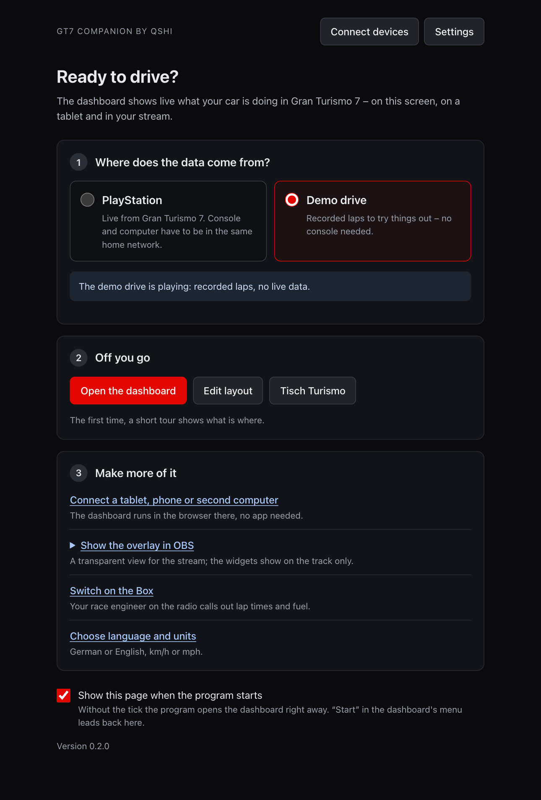
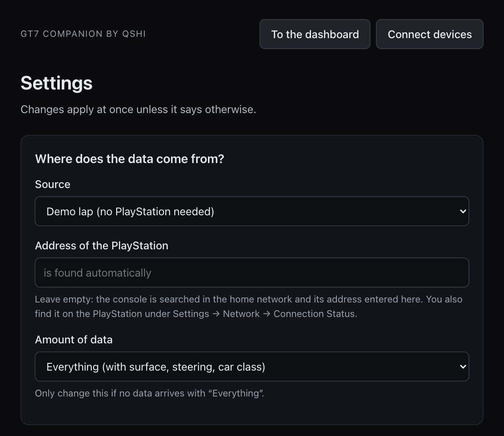
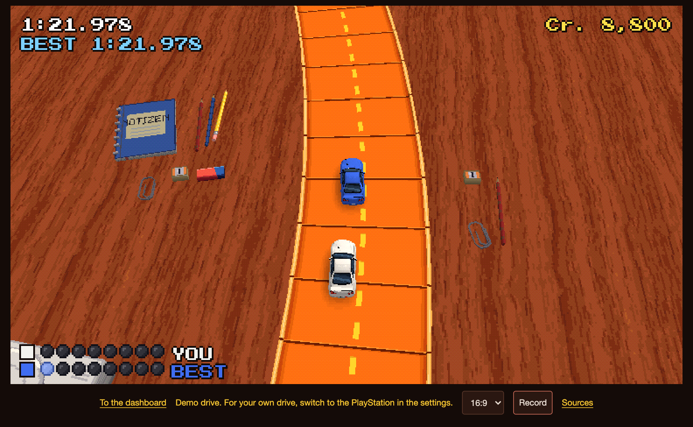

# Installing – step by step

*Deutsch: [INSTALL.de.md](INSTALL.de.md)*

You need a Mac or a Windows PC in the same home network as your PlayStation.

## Mac: the app (the short way)

For Macs with Apple silicon and macOS 14 or newer the program comes as a ready-made app – no
Python, no Terminal:

1. Download [GT7-Companion-by-qshi-mac-arm64.dmg](https://github.com/qshiqshi/gt7-companion-by-qshi/releases/latest/download/GT7-Companion-by-qshi-mac-arm64.dmg) and open it.
2. Drag the app into the "Applications" folder and start it from there. It is signed and
   notarised by Apple; on the first start macOS only asks whether you want to open an app
   downloaded from the internet: **Open**.
3. A window shows the start page. **Open the dashboard** shows a demo drive; go on with
   [4. Connect your PlayStation](#4-connect-your-playstation).

Closing the window does not quit the app: tablets and OBS keep getting their data. A click on
the icon in the Dock or on the symbol in the menu bar at the top right brings the window back;
quit with ⌘Q or through the symbol → **Quit**.

## Windows: the program (the short way)

For Windows 10 and 11 (64 bit; on an ARM computer it has to be Windows 11) the program comes
as a ZIP – no Python, no installer:

1. Download [GT7-Companion-by-qshi-windows-x64.zip](https://github.com/qshiqshi/gt7-companion-by-qshi/releases/latest/download/GT7-Companion-by-qshi-windows-x64.zip) and unpack it (right-click → **Extract All**).
2. Put the folder where it can stay, for example in "Documents", and start `gt7companion.exe`
   in it. The program is not signed, so Windows shows "Windows protected your PC": **More
   info** → **Run anyway**. The very first start takes a little longer.
3. A window shows the start page. **Open the dashboard** shows a demo drive; go on with
   [4. Connect your PlayStation](#4-connect-your-playstation).

Closing the window does not quit the program: tablets and OBS keep getting their data. The
symbol next to the clock (it may hide behind the small arrow) brings the window back and has
**Quit**. When the program first listens for the PlayStation or shares the dashboard in your
home network, the Windows firewall asks once: allow it for private networks.

The window needs the WebView2 runtime, which is part of Windows 11 and of an up-to-date
Windows 10. Without it the program opens the dashboard in your browser instead. On Windows the
Box speaks with Gemini (your own key); "Hey Box" is only available from source.

> The Windows program was built and started in a virtual machine (Windows 11 on ARM): window,
> symbol, a second start, the stand-in for the console. **On a real Windows PC it is
> untested**, and so are sound, microphone and a real PlayStation there. If something goes
> wrong, please open an issue: <https://github.com/qshiqshi/gt7-companion-by-qshi/issues>.

## From source (Mac, Windows, Linux)

Steps 1 to 3 are for everybody who prefers to start the program from source. They take about
ten minutes; nothing is installed outside the program's own folder (except Python itself).

> The Mac steps were run on a Mac with Apple silicon. **The Windows steps from source are
> untested** – they should work, but nobody has tried them on a real Windows PC yet.

## 1. Install Python (once)

The program is written in Python and needs version 3.12 or newer.

- **Mac:** download the installer from <https://www.python.org/downloads/> and run it.
- **Windows:** download the installer from <https://www.python.org/downloads/>, run it and tick
  **"Add python.exe to PATH"** on its first page.

## 2. Get the program

Open <https://github.com/qshiqshi/gt7-companion-by-qshi>, click the green button **Code** → **Download ZIP**. Unpack the
ZIP and move the folder to a place where it can stay, for example your Documents folder.

(If you know git: `git clone` the repository instead; `git pull` updates it later.)

## 3. Start it

- **Mac:** double-click `start-mac.command`. The first time macOS refuses because the file
  comes from the internet: right-click the file → **Open** → **Open**. (Or open the Terminal,
  type `bash `, drag the file into the window and press Return.)
- **Windows:** double-click `start-windows.bat`. If Windows shows "Windows protected your PC",
  click **More info** → **Run anyway**.

The first start sets everything up and takes a few minutes. Then a small symbol appears –
on the Mac in the menu bar at the top right, on Windows in the tray next to the clock – and
the start page opens in your browser. **Open the dashboard** shows a demo drive.

To quit, click the symbol → **Quit**. To start again, double-click the same file.


The first time, a few speech bubbles show what is where. While the demo drive plays, a strip
at the bottom says "Demo drive".

Move the pointer (or touch the screen) and a small menu appears at the top right – with
**Edit** you rearrange the dashboard, **Help** shows the speech bubbles again, **Start** leads
back to the start page:


In **Edit**, changes save automatically. **Save layout** keeps a checkpoint for this layout;
**Reset** returns to it. Existing layouts are protected before their first autosave after an
update. To return to a shipped preset instead, open **Own layout** → **Restore preset** and
confirm with a second click.

**Undo** or Ctrl/Cmd+Z reverses the last change (up to 100); a drag is one change. Select a
widget, then **Copy style** / **Paste style**, or Ctrl/Cmd+C/V, to transfer its style and scale.
Choose a global font under **Styling**, or an individual font with the widget's brush.
For the glass or dachshund, the brush also has **Movement** → **Sensitivity** (5–500%).
The glass starts at 25%, the dachshund at 100%; an existing custom value stays as it is.

## 4. Connect your PlayStation

1. PlayStation and computer are in the same home network (not a guest Wi-Fi).
2. Start Gran Turismo 7.
3. Choose **PlayStation** on the start page. (From the dashboard: menu → **Start**. The same
   works through the symbol → **Settings** → *Where does the data come from?*.)



The console is found by itself. The first time your computer asks whether the program may
receive data from the network – allow it (Windows: "Allow access"; Mac: "Allow").



Nothing arrives? Quit other telemetry programs (only one can listen at a time), and check
that both devices are in the same network.

## 5. Tablet, phone, second screen

Click the symbol → **Share in the home network**, then → **Connect devices**. Scan the QR code
with the tablet's camera. To change layouts on the tablet, tap **Edit** there and enter the
PIN from the same page.


## 6. Stream overlay in OBS

The overlay is a transparent view of its own for the stream. This is how it gets into OBS:

1. The program is running – its window may be closed.
2. In OBS click **+** under **Sources**, choose **Browser**, give it a name, **OK**.
3. Enter the address below as **URL**, **Width** 1920, **Height** 1080 (the size of your canvas
   if you stream in another size), then **OK**.
4. Drag the source above your game capture in the list.

```
http://127.0.0.1:8707/?obs=1
```


- The source is transparent. The driving widgets show on the track only; in the game's menus
  they hide.
- Arranging: open **Edit** in the program, choose the layout **Stream overlay 16:9** at the top
  and move the widgets. OBS shows every change at once.
- The voice of the Box comes out of this source, too. With **Control audio via OBS** in the
  source's properties it gets a fader of its own in the mixer.
- If OBS runs on another computer: symbol → **Share in the home network**, and use the address
  from the page **Connect devices** instead of `127.0.0.1`.

The little game **Tisch Turismo** – a toy car on a desk that drives what you drive – is a second
source of the same kind: width 1536, height 864, address:

```
http://127.0.0.1:8707/game?obs=1&format=wide
```



On the computer itself it opens from the menu of the symbol: **Tisch Turismo (game)**. The other
shapes of the picture and how your viewers can join in are in the
[README](../README.md#tisch-turismo--the-game-on-the-desk).

## 7. The Box – race engineer on the radio (optional)

**In the Mac app (macOS 26 or newer)** the Box needs nothing else: symbol → **Settings** →
*The Box*: tick **Switch on the messages**, **Save**, then **Test message**. Voice, speech
recognition and answers are the Mac's own – no key, no cost. (The first time macOS may
download speech data; after that it works without the internet.)

**Everywhere else – or if you choose so – Gemini by Google speaks:**

1. Get an API key in Google AI Studio (<https://aistudio.google.com/>). Using it costs money;
   Google bills it to your account.
2. Symbol → **Settings** → *The Box*: tick **Switch on the messages**, choose **Gemini by
   Google** under *Who speaks?*, **Save**. Then paste the key, **Save the key**, **Check** and
   **Test message**.


### Asking questions

Hold the **Talk** button in the menu of the dashboard, ask ("How much fuel do I have left?")
and let go. The first time the computer asks whether the program may use the microphone. In
the Mac app this needs Apple Intelligence to be switched on (System Settings → Apple
Intelligence & Siri); the messages work without it.

### "Hey Box" (optional)

To ask without pressing a button, tick **Listen for "Hey Box"** in the settings.

- **Mac app:** that is all, the Mac recognises speech itself.
- **From source** the computer needs speech recognition. Install it once and start the program
  again; the first use downloads the recognition model (about 500 MB):
  - **Mac:** open the Terminal, type `cd `, drag the program's folder into the window, press
    Return, then run: `.venv/bin/python -m pip install -e ".[wake]"`
  - **Windows:** open the program's folder, click into the address bar, type `cmd`, press
    Enter, then run: `.venv\Scripts\python.exe -m pip install -e ".[wake]"`

## Updating

- **Mac app:** download the new version and replace the app in "Applications".
- **Windows program:** quit it, download the new ZIP and replace the folder.
- **From source:** download the ZIP again and replace the folder (or `git pull`). If the start
  file reports a problem afterwards, delete the folder `.venv` inside the program's folder and
  start again.

Your settings and your own layouts are not inside the program; they stay.

## Removing

Quit the program and delete its folder (the Mac app: move it to the Bin). Your settings are in
`~/Library/Application Support/gt7-companion-by-qshi` (Mac) or
`%LOCALAPPDATA%\gt7-companion-by-qshi` (Windows); delete that folder, too, if you like.
